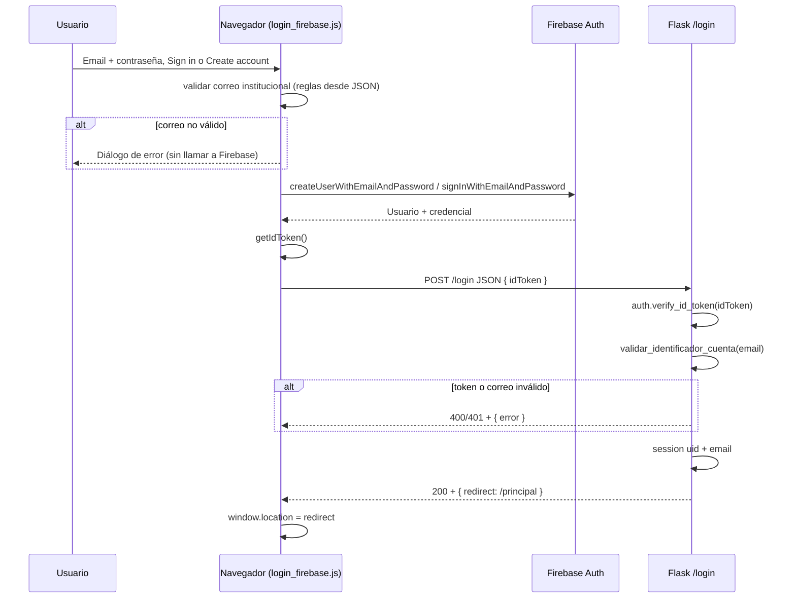

# Funcionalidad Firebase — ChemClassify (AplicacionWeb)

Este documento describe cómo está integrado Firebase en la aplicación Flask actual: **Firebase Authentication** (correo/contraseña en el cliente + verificación de token en el servidor), la configuración en **dos capas** (Admin SDK vs Web SDK), el **flujo de datos** del login, y **todos los puntos del código** donde interviene Firebase o configuración relacionada.

> **Alcance:** solo el árbol principal de `AplicacionWeb` (ChemClassify). Las carpetas `RefDocumentBackEnd/`, `RefDocumentFrontEnd/`, etc. son material de referencia de otro proyecto y **no** forman parte del runtime de esta app.

---

## 1. Objetivo del diseño

- El **navegador** usa el **Firebase JS SDK** para registrar o iniciar sesión con **email + contraseña** contra **Firebase Authentication** del proyecto.
- El **servidor Flask** **nunca** recibe la contraseña en claro para autenticar contra Firebase. Solo recibe un **ID token** JWT emitido por Firebase, lo **verifica** con el **Firebase Admin SDK**, aplica las reglas de **correo institucional**, y abre una **sesión** (`Flask session`).
- **Firestore** se inicializa junto con el Admin SDK (`db`), pero el flujo de login actual **no** lee ni escribe Firestore; queda listo para CRUD futuro (p. ej. `FirebaseOperacionesCRUD.py`).

---

## 2. Dos tipos de configuración (muy importante)

| Aspecto | Admin SDK (servidor) | Web SDK (navegador) |
|--------|----------------------|---------------------|
| **Qué es** | Cuenta de servicio (JSON privado) | Objeto `firebaseConfig` (`apiKey`, `projectId`, …) |
| **Dónde** | `CredencialesFirebase/*.json` (ruta en `FirebaseConfig.py`) | `Configuraciones/ConfiguracionLogin/FirebaseClienteWeb.py` + variables de entorno |
| **Riesgo** | **Secreto:** no versionar, no enviar al cliente | Pensado para exponerse en el front; la protección es por **dominios autorizados**, restricciones de clave en Google Cloud, reglas, etc. |
| **Uso aquí** | `initialize_app` + `firestore.client()` + `auth.verify_id_token` | `initializeApp` + `getAuth` + `signInWithEmailAndPassword` / `createUserWithEmailAndPassword` |

Son el **mismo proyecto Firebase** (`projectId` alineado), no dos proyectos distintos.

---

## 3. Requisitos en la consola de Firebase

1. **Authentication → Método de acceso:** habilitado **Correo electrónico / contraseña**.
2. **Authentication → Configuración → Dominios autorizados:** incluir `localhost`, `127.0.0.1` y el dominio de producción donde se sirva la app (necesario para que el cliente pueda autenticar).
3. **Project settings → General → Tu app web:** el objeto de configuración del SDK debe coincidir con lo que sirve Flask en `firebase_web_config_dict()` (especialmente `apiKey`). Si Google Cloud restringe la clave por **HTTP referrer**, añadir `http://127.0.0.1:5000/*` (y el puerto/host reales).

---

## 4. Arquitectura del flujo de login

**Doble validación de correo institucional**

1. **Cliente** (`login_firebase.js`): usa el JSON `#chem-login-email-rules-json` generado por `contexto_validacion_correo_cliente()` para **no** crear usuarios en Firebase con dominios no permitidos.
2. **Servidor** (`validar_identificador_cuenta` sobre el `email` del token): defensa en profundidad si alguien manipula el front o usa otro cliente.

Las reglas de dominio salen de `Configuraciones/ConfiguracionLogin/DominioPermitido.py` (`CHEMCLASSIFY_DOMINIO_CORREO` o valor por defecto `ucundinamarca.edu.co`).

---

## 5. Archivos y responsabilidades

### 5.1 Servidor (Python)

| Archivo | Rol |
|---------|-----|
| `LogicaMadre/LogicaFirebase/FirebaseConfig.py` | Inicializa `firebase_admin` una sola vez con `credentials.Certificate(...)` apuntando al JSON de servicio; expone `db = firestore.client()`. |
| `LogicaMadre/LogicaFlask/ClasePrincipalFlask.py` | App Flask: importa `FirebaseConfig` antes de usar `auth`; ruta `POST /login` (JSON) con `auth.verify_id_token`; sesión; rutas `/principal`, `/logout`; sirve datos al template del login. |
| `Configuraciones/ConfiguracionLogin/FirebaseClienteWeb.py` | Función `firebase_web_config_dict()` — objeto público para `initializeApp` en el navegador; claves sobreescribibles por env `CHEMCLASSIFY_FIREBASE_*`. |
| `Configuraciones/ConfiguracionLogin/DominioPermitido.py` | Dominio institucional permitido y helpers usados por la validación de correo. |
| `LogicaMadre/LogicaIdentificacion/ValidacionFormatoIdentificacion.py` | `validar_identificador_cuenta` (servidor) y `contexto_validacion_correo_cliente` (payload para el cliente). |
| `LogicaMadre/ConstructorClasesGlobales/InstanciasPrincipales.py` | Importa primero `FirebaseConfig` (`db`), luego `PlataformaWeb`, para que el Admin SDK esté inicializado al arrancar la app. |
| `main.py` | Punto de entrada: importa `PlataformaWeb` y `db` desde `InstanciasPrincipales`; `PlataformaWeb.run(debug=True)`. |
| `LogicaMadre/LogicaFirebase/FirebaseOperacionesCRUD.py` | Reservado para operaciones Firestore; actualmente vacío — no interviene en el login. |

### 5.2 Cliente (plantilla y JS)

| Archivo | Rol |
|---------|-----|
| `templates/PaginasAutenticacion/login.html` | Formulario email/contraseña; `data-login-url` para `fetch`; tres bloques `application/json`: error inicial, `firebase_web_config`, `login_email_rules`. |
| `static/PaginasAutenticacion/login_firebase.js` | Módulo ES: Firebase v10 desde CDN; validación institucional previa; Sign in / Create account; `fetch` del `idToken` a Flask. |
| `templates/PaginasSistema/principal.html` | Página tras login exitoso (muestra email de sesión y enlace a logout). |

### 5.3 Otros

| Archivo | Rol |
|---------|-----|
| `.gitignore` | Incluye `CredencialesFirebase/` para no subir el JSON del servicio. |
| `requirements.txt` | Dependencias `firebase_admin`, `Flask`, etc. |

---

## 6. Call sites desde la app Flask (referencia para el desarrollador)

### 6.1 Inicialización del Admin SDK y Firestore

- **`LogicaMadre/LogicaFirebase/FirebaseConfig.py`**  
  - Condición: `if not firebase_admin._apps`.  
  - `credentials.Certificate('CredencialesFirebase/chemclassify-d448c-firebase-adminsdk-fbsvc-333079f7f4.json')` (ruta relativa al cwd habitual al ejecutar desde la raíz de `AplicacionWeb`).  
  - `firebase_admin.initialize_app(cred)`  
  - `db = firestore.client()`

- **Quién importa `FirebaseConfig` (efecto colateral: init)**  
  1. `LogicaMadre/ConstructorClasesGlobales/InstanciasPrincipales.py` — línea que importa `db`.  
  2. `LogicaMadre/LogicaFlask/ClasePrincipalFlask.py` — `import LogicaMadre.LogicaFirebase.FirebaseConfig  # noqa: F401` para garantizar init antes de `auth.verify_id_token` aunque se importe la app Flask por otro camino.

- **`main.py`**  
  - Importa `InstanciasPrincipales` → se ejecuta la cadena anterior.

### 6.2 Firebase Auth (solo Admin `auth` en servidor)

- **`LogicaMadre/LogicaFlask/ClasePrincipalFlask.py`**  
  - `from firebase_admin import auth`  
  - **`POST /login` con `Content-Type: application/json`:**  
    - Lee `idToken` del cuerpo.  
    - `auth.verify_id_token(id_token)` → payload decodificado (`uid`, `email`, …).  
    - Errores → `401` genérico si el token no verifica.  
  - Tras éxito: `validar_identificador_cuenta(email)`; si falla → `400` + `{ "error": "<mensaje>" }`.  
  - `_session_apply_from_token(decoded)` → `session['uid']`, `session['email']`.  
  - Respuesta OK: `{ "redirect": "<url_for principal>" }`.

No hay otras llamadas a `firebase_admin.auth` en el árbol principal de ChemClassify.

### 6.3 Configuración Web para el template (no es llamada a la API de Google desde Python)

- **`Configuraciones/ConfiguracionLogin/FirebaseClienteWeb.py`** → `firebase_web_config_dict()`  
- **Call site:** `ClasePrincipalFlask.login()` → `render_template(..., firebase_web_config=firebase_web_config_dict(), ...)`

### 6.4 Reglas de correo para el cliente

- **`LogicaMadre/LogicaIdentificacion/ValidacionFormatoIdentificacion.py`** → `contexto_validacion_correo_cliente()`  
- **Call site:** `ClasePrincipalFlask.login()` → `login_email_rules=contexto_validacion_correo_cliente()`

### 6.5 Validación de correo en servidor (post-token)

- **`validar_identificador_cuenta`**  
- **Call sites en `ClasePrincipalFlask.py`:**  
  1. `POST` JSON tras `verify_id_token` (email del token).  
  2. `POST` formulario clásico (misma ruta `/login`): validación de campos vacíos y de identificador; si el usuario no usa los botones de Firebase, se muestra mensaje para usar Sign in / Create account.

### 6.6 Uso de `db` (Firestore)

- **`main.py`:** `if db: print('ok')` — comprobación trivial de que Firestore cliente existe.  
- **`InstanciasPrincipales`:** reexporta `db` para el resto del proyecto.  
- Ninguna ruta Flask actual usa `db` en el flujo de login.

---

## 7. Contrato HTTP del login con Firebase (JSON)

- **URL:** misma que el formulario, `url_for('login')` — típicamente `/login`.  
- **Método:** `POST`  
- **Cabeceras:** `Content-Type: application/json`  
- **Cuerpo:** `{ "idToken": "<JWT de Firebase>" }`  
- **Respuestas:**  
  - `200` — `{ "redirect": "/principal" }` (ruta relativa devuelta por Flask).  
  - `400` — `{ "error": "..." }` (token ausente, email vacío en token, correo no institucional).  
  - `401` — `{ "error": "Invalid or expired sign-in..." }` (token inválido o expirado).

El cliente asigna `window.location` al valor de `redirect`.

---

## 8. Sesión Flask y rutas relacionadas

| Ruta | Comportamiento |
|------|----------------|
| `GET /` | Redirección a `login`. |
| `GET /login` | Si ya hay `session['uid']`, redirección a `principal`. Si no, renderiza `login.html` con config Firebase + reglas email + mensajes. |
| `POST /login` (JSON) | Flujo token descrito arriba. |
| `POST /login` (form) | Validaciones básicas; no completa login Firebase sin JS. |
| `GET /principal` | Exige `session['uid']`; si no, redirección a `login`. |
| `GET /logout` | `session.clear()` y redirección a `login`. |

**`Flask.secret_key`:** `FLASK_SECRET_KEY` en entorno, o valor de desarrollo por defecto en código — **cambiar en producción**.

---

## 9. Variables de entorno relevantes

| Variable | Uso |
|----------|-----|
| `FLASK_SECRET_KEY` | Firma de cookies de sesión. |
| `CHEMCLASSIFY_DOMINIO_CORREO` | Dominio institucional (sin `@`); ver `DominioPermitido.py`. |
| `CHEMCLASSIFY_FIREBASE_API_KEY` | Sobreescribe `apiKey` del config web. |
| `CHEMCLASSIFY_FIREBASE_AUTH_DOMAIN` | Sobreescribe `authDomain`. |
| `CHEMCLASSIFY_FIREBASE_PROJECT_ID` | Sobreescribe `projectId`. |
| `CHEMCLASSIFY_FIREBASE_STORAGE_BUCKET` | Sobreescribe `storageBucket`. |
| `CHEMCLASSIFY_FIREBASE_MESSAGING_SENDER_ID` | Sobreescribe `messagingSenderId`. |
| `CHEMCLASSIFY_FIREBASE_APP_ID` | Sobreescribe `appId`. |
| `CHEMCLASSIFY_FIREBASE_MEASUREMENT_ID` | Opcional; Analytics. |

Si el navegador muestra errores tipo `auth/api-key-not-valid`, alinear estos valores con **Project settings → General** de Firebase y con restricciones de la clave en Google Cloud.

---

## 10. Depuración en el navegador

En `static/PaginasAutenticacion/login_firebase.js` se registran mensajes en consola con prefijos:

- **`[ChemAuth:rules]`** — correo bloqueado antes de Firebase.  
- **`[ChemAuth:firebase]`** — error o intento contra Firebase Auth.  
- **`[ChemAuth:session]`** — respuesta HTTP del `POST` con `idToken` o cuerpo inesperado.  
- **`[ChemAuth:config]`** — JSON de configuración inválido o ausente.

Abrir **Herramientas de desarrollador (F12) → Consola** durante las pruebas.

---

## 11. Seguridad y límites del modelo actual

- **Fortalezas:** contraseña solo en Firebase; servidor confía en tokens firmados; doble chequeo de dominio institucional.  
- **Límites:** quien tenga el `apiKey` y las reglas de dominio puede intentar crear cuentas **directamente** contra la API de Firebase (otro cliente). Para impedir cuentas no institucionales a nivel de **proyecto**, haría falta **Blocking Functions** (`beforeCreate`) o políticas adicionales en Firebase/Google Cloud.  
- **Firestore:** el Admin SDK **omite** las reglas de seguridad de Firestore; cualquier código futuro que use `db` debe validar permisos en aplicación o usar el SDK de cliente con reglas adecuadas.

---

## 12. Resumen rápido para un segundo desarrollador

1. Colocar el JSON del servicio en `CredencialesFirebase/` (no versionado).  
2. Ajustar dominio institucional en `DominioPermitido.py` o `CHEMCLASSIFY_DOMINIO_CORREO`.  
3. Alinear `FirebaseClienteWeb.py` (o env) con la app web en la consola de Firebase.  
4. Arrancar con `main.py`; el login vive en `templates/PaginasAutenticacion/login.html` + `login_firebase.js`.  
5. Toda la lógica servidor de token está en `ClasePrincipalFlask.login()` para `request.is_json`.  
6. `db` está listo en `InstanciasPrincipales` / `FirebaseConfig.py` para la siguiente fase de datos en Firestore.

---

*Última revisión alineada con el código en el repositorio ChemClassify `AplicacionWeb` (Flask + Firebase Auth + sesión + validación institucional).*
