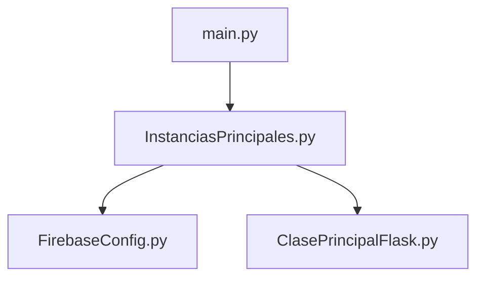

# Funcionalidad Flask — ChemClassify (AplicacionWeb)

Este documento describe cómo está montada la **aplicación web Flask** en el proyecto: arranque desde **`main.py`**, el objeto **`PlataformaWeb`**, uso de **plantillas (Jinja2)**, **archivos estáticos**, **sesiones**, **peticiones** y **rutas**. Complementa `FuncionalidadFirebase.md` (autenticación con token) centrándose en la capa HTTP y presentación.

> **Alcance:** raíz del proyecto `AplicacionWeb`. No incluye carpetas de referencia externas (`RefDocument*`, etc.) salvo mención de que no son el servidor ChemClassify.

---

## 1. Objetivo del diseño

- Una **sola instancia** de aplicación Flask (`PlataformaWeb`) concentra todas las rutas actuales.
- Las **vistas** viven en `LogicaMadre/LogicaFlask/ClasePrincipalFlask.py`; el **punto de entrada** que arranca el servidor de desarrollo es `main.py`.
- Las **plantillas HTML** están bajo `templates/`; **CSS, JS e imágenes** servidos por Flask bajo `static/` (convención estándar de Flask).
- La **sesión** de Flask guarda `uid` y `email` tras un login válido (tras verificación del token Firebase); las rutas protegidas comproban la sesión antes de renderizar.

---

## 2. Cómo se ejecuta el programa: `main.py`

Archivo: **`main.py`** (en la raíz de `AplicacionWeb`).

```python
from LogicaMadre.ConstructorClasesGlobales.InstanciasPrincipales import PlataformaWeb, db

def main():
    if db:
        print('ok')
    PlataformaWeb.run(debug=True)

if __name__ == '__main__':
    main()
```

### 2.1 Qué hace cada parte

| Paso | Descripción |
|------|-------------|
| **Import** | Carga `InstanciasPrincipales`, que a su vez importa **`FirebaseConfig`** (inicializa Firebase Admin + Firestore `db`) y luego **`ClasePrincipalFlask`** (define `PlataformaWeb`). Así, al arrancar, el entorno backend (Firebase) queda listo antes de usar la app. |
| **`if db: print('ok')`** | Comprobación trivial de que el cliente de Firestore se creó; útil como sanity check en consola al desarrollar. |
| **`PlataformaWeb.run(debug=True)`** | Arranca el **servidor de desarrollo integrado** de Werkzeug/Flask: recarga automática ante cambios, trazas de error en el navegador, etc. **No usar `debug=True` en producción.** |
| **`if __name__ == '__main__'`** | Garantiza que `main()` solo se ejecuta al lanzar el script directamente (`python main.py`), no al importar el módulo desde otro sitio. |

### 2.2 Directorio de trabajo (cwd)

Flask y las rutas relativas del **certificado Firebase** (`CredencialesFirebase/...` en `FirebaseConfig.py`) asumen normalmente que el proceso se inicia **desde la carpeta `AplicacionWeb`** (raíz del proyecto web). Si se ejecuta desde otro directorio, pueden fallar rutas a archivos; en producción suele usarse un **WSGI** (`gunicorn`, `waitress`, etc.) con `cwd` o rutas absolutas configuradas.

### 2.3 Puerto y host por defecto

Sin argumentos extra, `app.run()` escucha en **`127.0.0.1:5000`**. Para otra interfaz/puerto: `PlataformaWeb.run(debug=True, host='0.0.0.0', port=8080)`.

---

## 3. Cadena de imports hasta la aplicación Flask



1. **`main.py`** importa `InstanciasPrincipales`.  
2. **`InstanciasPrincipales.py`** importa primero `db` desde **`FirebaseConfig`**, después **`PlataformaWeb`** desde **`ClasePrincipalFlask`**.  
3. **`ClasePrincipalFlask`** importa de nuevo `FirebaseConfig` (comentado como garantía de init antes de `auth`) y construye el objeto **`Flask`**.

El **nombre del módulo** pasado a `Flask(__name__)` es el de `ClasePrincipalFlask` (`LogicaMadre.LogicaFlask.ClasePrincipalFlask`); eso afecta a la resolución de recursos en algunos despliegues; aquí lo importante es que **`template_folder`** y **`static_folder`** se fijan **en rutas absolutas** derivadas de `BASE_DIR`.

---

## 4. Construcción de `PlataformaWeb` y carpetas `templates` / `static`

Archivo: **`LogicaMadre/LogicaFlask/ClasePrincipalFlask.py`**.

```text
BASE_DIR = Path(__file__).resolve().parents[2]
```

- `__file__` apunta a `.../LogicaMadre/LogicaFlask/ClasePrincipalFlask.py`.  
- **`.parents[2]`** sube a la raíz **`AplicacionWeb/`** (padre de `LogicaMadre/`).

Luego:

```python
PlataformaWeb = Flask(
    __name__,
    template_folder=str(BASE_DIR / 'templates'),
    static_folder=str(BASE_DIR / 'static'),
)
```

| Parámetro | Valor efectivo | Significado |
|-----------|----------------|-------------|
| `template_folder` | `AplicacionWeb/templates` | Donde busca **`render_template('ruta/relativa.html')`**. |
| `static_folder` | `AplicacionWeb/static` | URL base **`/static/...`** generada por **`url_for('static', filename='...')`**. |

Sin esta configuración explícita, Flask usaría por defecto `templates/` y `static/` **junto al paquete** donde está el módulo (`LogicaMadre/LogicaFlask/`), lo cual no coincide con la estructura del repo. **`BASE_DIR`** centraliza todo en la raíz del proyecto web.

### 4.1 `secret_key` (sesiones)

```python
PlataformaWeb.secret_key = os.environ.get(
    'FLASK_SECRET_KEY',
    'chemclassify-dev-secret-change-in-production',
)
```

Flask firma la **cookie de sesión** con `secret_key`. En producción debe definirse **`FLASK_SECRET_KEY`** en el entorno con un valor aleatorio largo.

---

## 5. Rutas HTTP actuales

Todas registradas en **`ClasePrincipalFlask.py`** sobre **`PlataformaWeb`**.

| Ruta | Métodos | Función | Respuesta típica |
|------|---------|---------|-------------------|
| `/` | GET | `index` | **302** → `/login` |
| `/login` | GET, POST | `login` | GET: HTML login o redirect a principal si ya hay sesión. POST: JSON (token) o formulario HTML. |
| `/principal` | GET | `principal` | HTML bienvenida o **302** → login sin sesión. |
| `/logout` | GET | `logout` | Limpia sesión, **302** → `/login`. |

Los **nombres de función** (`login`, `principal`, …) son los que usa **`url_for('login')`**, etc., en plantillas y en `redirect`.

---

## 6. Herramientas Flask usadas en el proyecto

### 6.1 `render_template`

Genera HTML a partir de un archivo en **`template_folder`**, con motor **Jinja2**.

**Call sites actuales:**

- **`login()`** (al final, para GET o POST form sin early return):  
  `render_template('PaginasAutenticacion/login.html', error_message=..., success_message=..., account_value=..., ejemplo_correo=..., firebase_web_config=..., login_email_rules=...)`

- **`principal()`:**  
  `render_template('PaginasSistema/principal.html', session_email=...)`

Las variables pasadas como argumentos con nombre son el **contexto** disponible en la plantilla (`{{ error_message }}`, etc.).

### 6.2 `url_for`

Genera URLs **internas** a la app sin hardcodear rutas.

**En plantillas:**

- `{{ url_for('login') }}` — acción del formulario y `data-login-url` para `fetch`.  
- `{{ url_for('static', filename='EstilosCSS/styles.css') }}` — enlace a CSS bajo `/static/EstilosCSS/styles.css`.  
- `{{ url_for('logout') }}` — enlace de cierre de sesión en `principal.html`.

**En Python:**

- `url_for('principal')` dentro de `jsonify(redirect=...)` devuelve la ruta de la página principal.

Si se renombran rutas o se monta la app bajo un prefijo (`APPLICATION_ROOT`), `url_for` sigue siendo el mecanismo correcto.

### 6.3 `redirect` y códigos HTTP

- `return redirect(url_for('login'), code=302)` en `index`.  
- Tras login GET con sesión válida → `principal`.  
- `principal` sin `session['uid']` → `login`.  
- `logout` → `login`.

### 6.4 `request`

- **`request.method`**: distingue GET vs POST.  
- **`request.is_json`**: True cuando el cuerpo es JSON (`Content-Type: application/json`) — flujo del **ID token** Firebase.  
- **`request.get_json(silent=True)`**: lee el dict del POST JSON sin lanzar si el cuerpo es inválido.  
- **`request.form.get('accountName')`**, **`request.form.get('password')`**: POST clásico `application/x-www-form-urlencoded` (formulario HTML). El flujo principal de auth usa JSON; el form sigue existiendo por compatibilidad y mensajes de validación.

### 6.5 `jsonify`

Devuelve respuestas **JSON** con el tipo MIME correcto. Usado en **`POST /login`** con token: errores `400`/`401` con `{ "error": "..." }` y éxito `200` con `{ "redirect": "..." }`.

### 6.6 `session`

Diccionario persistente en **cookie firmada** (no almacenamiento en servidor por defecto).

- Claves usadas: **`uid`** (Firebase), **`email`**.  
- Escritura: `_session_apply_from_token` tras `verify_id_token` exitoso.  
- Lectura: `session.get('uid')`, `session.get('email')` en `principal` y al decidir redirect en GET `/login`.  
- **`session.clear()`** en `logout`.

---

## 7. Plantillas (`templates/`)

### 7.1 Organización por carpetas

| Ruta de archivo | Uso |
|-----------------|-----|
| `templates/PaginasAutenticacion/login.html` | Página de login: formulario, includes, scripts JSON embebidos, módulo JS de Firebase. |
| `templates/PaginasSistema/principal.html` | Página tras autenticación: muestra correo de sesión y enlace a logout. |
| `templates/Sistemas/fragmento_alerta_error.html` | Fragmento reutilizable del **diálogo de aviso** (overlay naranja). |

### 7.2 ``

`login.html` incluye el fragmento de error:

```jinja

```

La ruta es **relativa a `template_folder`**, sin prefijo `templates/`.

### 7.3 Jinja2 y datos dinámicos

- **`{{ variable }}`**: sustitución escapada por defecto (seguro para HTML).  
- **`{{ error_message|tojson }}`**: serializa a JSON literal para un `<script type="application/json">` consumido por JS (evita errores de sintaxis en el analizador de scripts del IDE).

### 7.4 Relación con `static/`

Las plantillas **no** contienen rutas absolutas a `/static/...` a mano: usan **`url_for('static', filename='...')`** para que Flask genere la URL correcta aunque la app se sirva bajo un subpath en el futuro.

---

## 8. Archivos estáticos (`static/`)

Todo lo bajo **`static/`** se expone en la URL **`/static/<ruta>`** (nombre del endpoint `'static'`).

### 8.1 Inventario actual (referencia)

| Ruta en disco | Uso típico |
|---------------|------------|
| `static/EstilosCSS/styles.css` | Estilos globales del login y principal; fondo vía `url('../imagenes/QrBG.jpg')` (ruta **relativa al CSS** → `static/imagenes/QrBG.jpg`). |
| `static/Sistemas/alerta_error_usuario.css` | Estilos del modal de aviso. |
| `static/Sistemas/alerta_error_usuario.js` | Lógica del modal; expone `window.SistemasErrores.mostrar(...)`. |
| `static/PaginasAutenticacion/login_firebase.js` | Módulo ES6: Firebase Auth en cliente + `fetch` al login. |

Añadir nuevos assets (imágenes, bundles) bajo **`static/`** manteniendo subcarpetas por dominio (`EstilosCSS/`, `Sistemas/`, etc.) facilita el mantenimiento.

### 8.2 Módulos JavaScript (`type="module"`)

`login.html` carga:

```html
<script type="module" src="{{ url_for('static', filename='PaginasAutenticacion/login_firebase.js') }}"></script>
```

Los **módulos** se ejecutan en modo estricto y pueden usar `import` desde CDN (Firebase). El orden importa: primero scripts que definen `SistemasErrores`, luego el módulo que los usa.

---

## 9. Textos de error centralizados: `ManejadorErroresInterfaz`

Archivo: **`LogicaMadre/Sistemas/ManejadorErroresInterfaz.py`**.

- Constantes para mensajes del formulario (cuenta/clave vacías).  
- Métodos auxiliares `contexto_error` / `limpiar_error_en_contexto` para fusionar `error_message` en un dict de contexto (útiles si se amplía el número de vistas).

**Call site:** `ClasePrincipalFlask.login()` en la rama **POST formulario** asigna `error_message` desde estas constantes o desde `validar_identificador_cuenta`.

---

## 10. Patrones que aún no se usan (orientación futura)

| Tema | Estado en ChemClassify |
|------|-------------------------|
| **Blueprints** | No hay; todas las rutas están en un solo módulo. Para crecer, se puede dividir por dominio (`auth_bp`, `api_bp`). |
| **`before_request` / `@login_required`** | La protección de `/principal` es **manual** (`if not session.get('uid')`). Se puede extraer a un decorador o a `before_request`. |
| **Factoría `create_app()`** | No existe; la app es global `PlataformaWeb`. Para tests o múltiples configs, suele crearse `create_app(config_name)`. |
| **CSRF (`Flask-WTF`)** | No está en el proyecto; el POST JSON del token no usa formulario HTML clásico. Si se añaden formularios mutables, valorar **CSRF**. |

---

## 11. Resumen para un segundo desarrollador

1. Ejecutar **`python main.py`** desde **`AplicacionWeb/`** (o el intérprete del venv del proyecto).  
2. La app Flask es **`PlataformaWeb`** en **`ClasePrincipalFlask.py`**; rutas y lógica HTTP están ahí.  
3. **HTML:** carpeta **`templates/`**; rutas en `render_template` sin prefijo `templates/`.  
4. **CSS/JS/imágenes:** carpeta **`static/`**; enlazar siempre con **`url_for('static', filename=...)`** en plantillas.  
5. **Sesión:** `secret_key` + claves `uid` / `email`; **`/principal`** y GET **`/login`** dependen de ellas.  
6. Para más detalle del login con Firebase, ver **`Documentacion/FuncionalidadFirebase.md`**.

---

*Documentación alineada con el código actual de `AplicacionWeb` (Flask 3.x según `requirements.txt`).*
